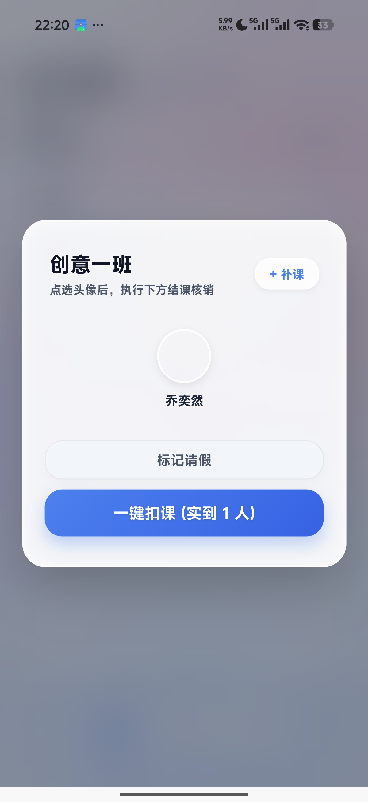
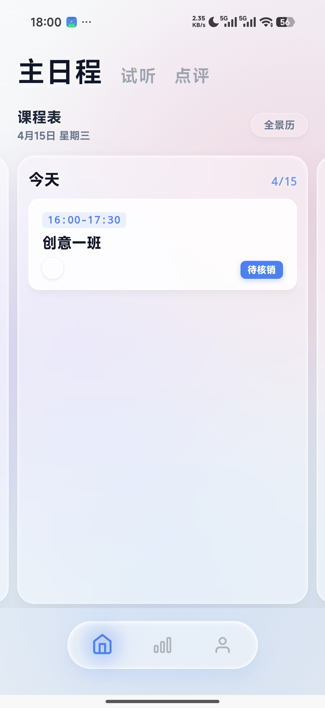
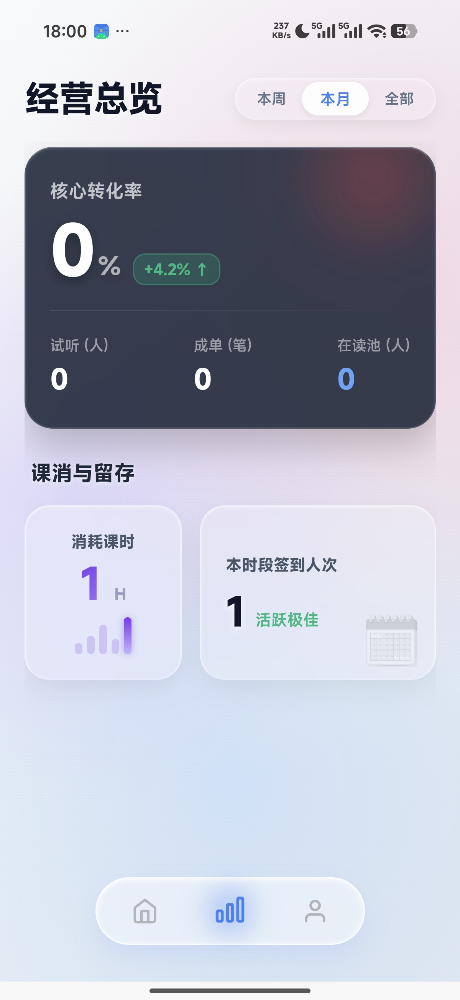
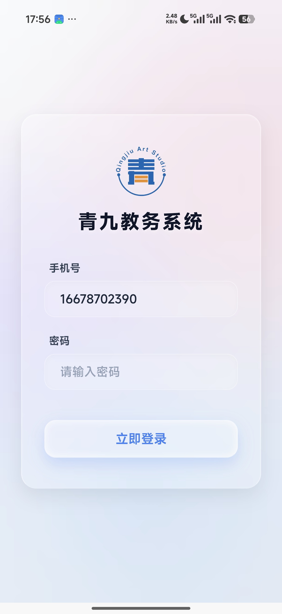
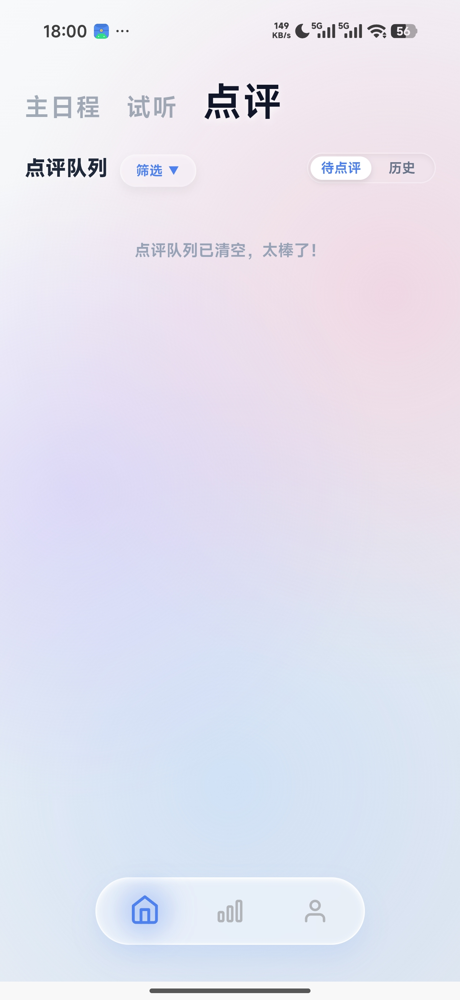
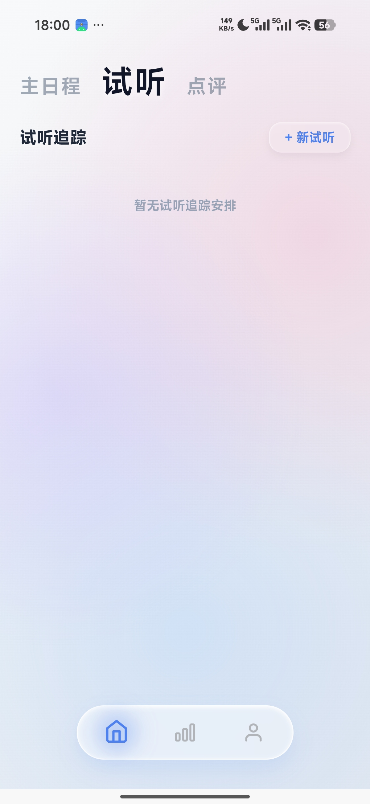
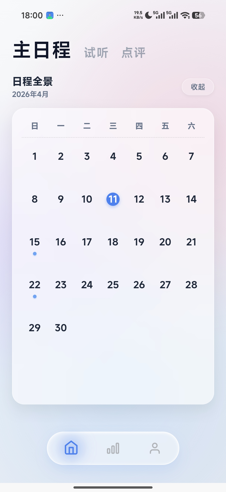
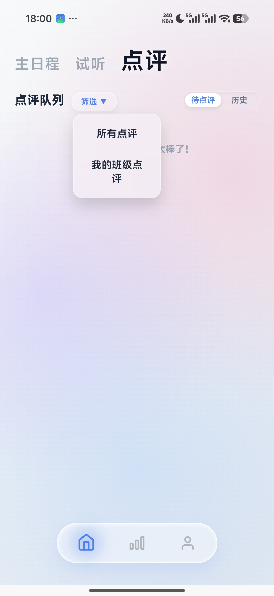
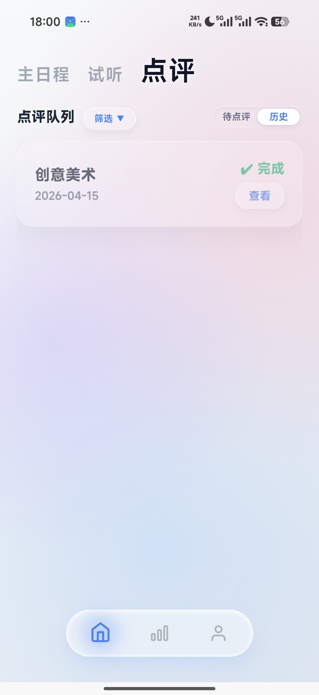

# 教师端 App (UniApp) 重构执行架构图 (File-by-File Blueprint)

> [!IMPORTANT]
> 此为教师端底层逆向代码结构的最终执行标准。该方案基于后台 `adminOperate` 函数破译，结合最新的原生操作截图进行 1:1 组件级重构绑定！不准使用硬编码，所有的渲染必须从云开发直接同步。

## 0. 全流程实机操作录屏 (App Flow Reference)
> [!NOTE]
> 请参考以下全局交互录屏。在构建 Mescroll 长列表组件、悬浮弹窗动画时，必须以该演示视频的流畅度作为硬重构验收标准。


---

## 1. 核心网络底座 (API Gateway)
#### [NEW] `utils/cloud-request.js`
- 建立全局封装的方法 `export const adminOperate = (action, payload) => {}`
- 在拦截器内将本地缓存在 Storage 的 `_callerPhone` 与 `_callerPassword` 作为鉴权凭据强行注入 Payload，拒绝则弹出统一 Toast。

---

## 2. 页面与组件路由逻辑 (Views & Components)
> 基于 SPA 底座特性，严禁使用原生 `pages.json` 分配多页。以下所有子组件均需通过 `pages/index/index.vue` 使用 `v-if` 或子路由视图挂载！

#### [NEW] `components/ScheduleDashboard.vue` (排课与消课日程板)
- 【UI 绑定】：这里对接“试听排课”与主日程表。上方应该置顶一个折叠式物理月历。
- 【交互动作】：列表中的每个条目点击后，需唤起包含 `consumeHours` 输入框的自定义金额/时长划扣组件。确认后，抛向 `{action: 'batchConsume'}` 扣减学生库。
````carousel

<!-- slide -->

<!-- slide -->

<!-- slide -->

````

#### [NEW] `components/ReviewCenter.vue` (点评作业上架中心)
- 【UI 绑定】：展示由 `batchConsume` 平移过来的已消课名单。
- 【交互动作】：点击提交作业照片时，**必须先行控制流上传**，使用 `wx.cloud.uploadFile` 取回 `cloud://` 前缀链接后，再拼接图文送入 `{ action: 'updateReview' }` 封板。
````carousel

<!-- slide -->

<!-- slide -->

````

#### [NEW] `components/AdminPanel.vue` (权限配置与审批后台)
- 【特殊鉴权】：此组件仅当 `login` 返回的 `user.role === 'admin'` 时方可在 C 端导航栏曝出。
- 【核心动作】：承接家长端流转过来的新学员挂靠请求 `applications`，填写建档信息后进行 `{action:'addStudent'}` 连贯签署。
````carousel

<!-- slide -->

<!-- slide -->

````

## Verification Plan (交付核销测试)
1. **静默鉴权拦截器脱壳**：强行杀死主进程，重新启动后检查能否根据 Storage 的 Key 无缝透传过 `{ action: 'login' }`。
2. **消课并发衰减校验**：在一个满编的舞蹈大班中对多位学员进行 `_inc` 复合扣减。随后立即前去云平台核实所有学生的 `remain` 课时字段均为服务器端原子运算后的结果。
