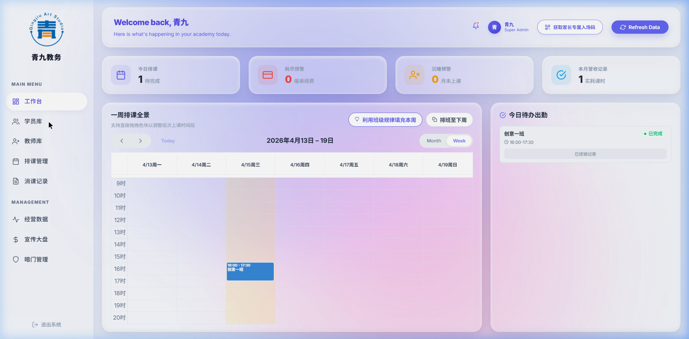
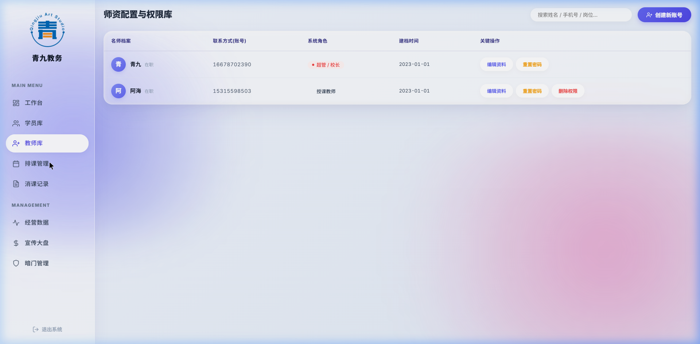
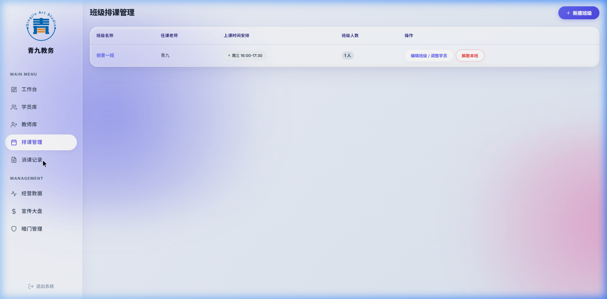

# 闈掍節鏁欏姟绯荤粺锛堟渶缁堜笂绾跨増锛夐€嗗悜閲嶅缓寮€鍙戣鑼?
> [!IMPORTANT]
> 姝ゆ枃妗ｄ负绯荤粺鏈€缁堝彂甯冨悗锛岀敱鑷姩宸℃浣撶郴杩涘叆鐪熷疄绠＄悊鍚庡彴杩涜閫嗗悜鎶撳彇鐨勮鑼冧骇鐗┿€傛棭鏈熺殑绂荤嚎澶囦唤浠ｇ爜宸蹭抚澶辨剰涔夊苟鍖呭惈娴烽噺閿欒閫昏緫锛?*Hermes 蹇呴』瀹屽叏搴熷純鏃ч€昏緫锛屼互姝ゆ枃妗ｅ強鎶㈡晳鍥炵殑浜戝嚱鏁拌祫婧愪负鍞竴寮€鍙戝弬鐓х郴銆?*

![绯荤粺鏁翠綋宸℃鍏ㄨ繃绋嬪綍灞廬(explore_final_admin_1776266799766.webp)

## 1. 鏋舵瀯鎸囧寳涓庢妧鏈簳搴?- **鍓嶇閲嶆瀯瑕佹眰**锛歏ue 3 + Vite锛?*蹇呴』**寮曞叆 Element Plus 鎴?Naive UI 浣滀负缁熶竴瑙嗗浘鍩哄缓锛堝師绯荤粺涓嚜缁樼殑鎵嬫悡寮圭獥蹇呴』鍏ㄩ儴鐢ㄧ粍浠跺簱閲嶆瀯锛夈€?- **浜戠鏈嶅姟浜や簰**锛氬井淇′簯寮€鍙?Web SDK锛圕loudBase锛夈€?- **涓氬姟鍑芥暟鏍稿績**锛氬師蹇€熷惎鍔?Demo 搴熷純銆傞噸鏋勬墍鏈夋帴鍙ｏ紝瀵规帴鑷充綅浜?`E:\闈掍節鏁欏姟绯荤粺-涓夌锛堥噸鏋勶級\鎶㈡晳浜戝嚱鏁癨cloudfunctions\adminOperate` 涓殑鐪熷疄澶勭悊閫昏緫銆傚寘鍚簨鍔℃墽琛屻€侀€氱煡涓嬪彂銆佹晱鎰熸搷浣滈壌鏉冨叏鍦ㄨ繖涓€涓簯鍑芥暟鍐呴儴娑堝寲銆?
---

## 2. 鍏ㄥ眬閫氱敤璁捐 (Global GUI & Routing)

### 2.1 鐧诲綍鍩?![鐧诲綍椤垫埅鍥惧睍绀篯(click_feedback_1776266877636.png)
- **鏈哄埗杞崲**锛氬簾闄ょ函鍓嶇 `admin` 妫€娴嬨€傚鎺?CloudBase 鐨勮嚜瀹氫箟閴存潈锛屾敮鎸佸璐﹀彿鍒嗛厤锛堢ず渚嬪叆搴撶鐞嗚处鍙凤細`16678702390`锛夈€?
### 2.2 妯″潡渚ц竟鏍忎綋绯?(Sidebar Layout)
鏁翠釜绯荤粺鍒嗕负宸﹀彸妗嗘灦锛岄噰鐢?`vue-router` 鎺у埗锛屼竷澶ф牳蹇冩ā鍧楀涓嬶細
1. **宸ヤ綔鍙颁腑蹇?(Dashboard)** `/dashboard`
2. **瀛﹀憳妗ｆ绠＄悊 (Students)** `/students`
3. **鏁欏笀涓庢帓鐝粍 (Teachers)** `/teachers`
4. **鎺掕涓庣彮娆″紩鎿?(Courses & Classes)** `/courses`
5. **娑堣璐︾洰涓績 (Records)** `/records`
6. **璐㈠姟娴佹按涓庢嫑鐢熸捣鎶?(Business)** `/business`
7. **鍏ㄥ眬楂樼骇鏆楅棬閰嶇疆 (Secret/Sysconfig)** `/secret`

---

## 3. 璇︾粏瀛愭ā鍧楀姛鑳借摑鍥?(Modules Deep-Dive)

### 3.1 瀛﹀憳妗ｆ搴?(Student Library)

- **鍦烘櫙鎽樿**锛氭暣涓?ERP 鐨勮鑴夊簱锛岄渶瑕佹瀬楂樼殑鍔犺浇鏁堢巼銆傚甫鏈夋潯浠舵悳绱紙妯＄硦妫€绱級銆?- **瀛楁闄堝垪**锛氬鍙枫€佸鍚嶃€佹€у埆銆佸勾榫勩€佸闀跨數璇濄€佸綋鍓嶇彮娆°€佺粦瀹氳绋嬨€佽喘涔版椂鏁般€佽禒閫佹椂鏁般€?*鍓╀綑鍙敤锛堥渶甯︽湁鏁板瓧璺岀牬璀︽垝鐨勬覆鏌擄級**銆佽绾ф搷浣滄爮銆?- **鍏宠仈绾ц〃鍗?*锛?  - **[鏂板缓妗ｆ]**锛氭爣鍑嗗綍鍏ヨ〃鍗曘€?  - **[缁垂鍏呭€肩獥]**锛氶€夋嫨璇惧寘瑙勬牸 -> 杈撳叆鏈澧炲姞璇炬椂鍜岃禒閫佹暟 -> 濉啓瀹炴敹閲戦 -> 瑙﹀彂缁垂閫昏緫锛堝悓鏃剁骇鑱旇Е鍙戝啓鍏ヨ储鍔″簱锛夈€?
### 3.2 鏁欏笀妗ｆ搴?(Teacher Library)
![鏁欏笀搴撶晫闈(click_feedback_1776266983469.png)
- **鍦烘櫙鎽樿**锛氬垎绂讳簡鏉冮檺缁勭鐞嗕笌鏁欏姟鍛樺伐绠＄悊銆?- **鏍稿績閫昏緫**锛氭柊澧炶处鍙峰悗鐢熸垚瀵瑰簲鐨?`uid` 鍜屽瘑鐮佸搱甯岋紙鎴栬姹傞娆″己鍒跺井淇℃壂鐮佺粦瀹氾級銆傝瀹氳韩浠斤紙Admin 鎴栨爣鍑?Teacher锛夌洿鎺ュ奖鍝嶅叾鍦?APP 绔殑璇曞浘鑼冪暣銆?
### 3.3 鎺掕寮曟搸绠＄悊鍣?(Courses Management)

- **鍦烘櫙鎽樿**锛氭柊鐗堢殑閲嶇偣銆傚墺绂讳簡鍘熸湰鍩轰簬鍓嶅彴纭啓鐨?JSON锛屾敮鎸佸畬鏁寸殑鏃ュ巻鍖栨垨鎵瑰鐞嗗寲璋冨害銆?- **澶勭悊绛栫暐**锛?  - **鐢熸垚鍗曠彮 (Single Class)**锛氬畾涔夊紑璇炬槦鏈?鏃ュ瓙銆佷笂璇惧叿浣撴椂娈靛尯闂淬€佷富甯︽暀甯堥€夐」銆佸嬀閫変笂璇惧鐢熺兢闆嗐€?  - **璇剧▼搴撶淮绯?*锛氬缓绔嬭鑼冪殑璇剧▼鍝佺被鍚嶅綍锛屼笉鏄鐢ㄦ埛闅忎究鏁叉枃鏈锛岃€屾槸浠庡悗鍙颁笅鎷夊垪琛ㄦ彁鍙栵紝闃茶剰鏁版嵁銆?
### 3.4 璐︾洰鏍稿績鈥斺€旀秷璇捐褰曞彴 (Consumption Desk)

- **鍦烘櫙鎽樿**锛氭満鏋勮€佸笀鏈€楂橀鐨勬搷浣滃彛銆?- **鐐硅瘎琛ㄥ崟 (Check-in Modal)**锛?  - 瀛﹀憳涓庤绋嬮€夋嫨锛堥檮甯︽墸璐瑰墠鐨勪綑棰濋€忚锛夈€?  - 鏍搁攢鑺傛暟锛堥€氬父涓?1 鎴?2锛夈€?  - **鐐圭潧璁捐**锛氬紩鐢ㄥ揩閫熻瘎浠锋ā鏉裤€傛敮鎸佸瘜鏂囨湰鍖栧綍鍏ャ€?  - **澶氬獟鐩翠紶**锛氭敮鎸佸寮犵編鏈敾浣滐紙鍚槻鎶栥€佷綋绉帇缂╅檺鍒跺悗璋冪敤 CloudBase 鑾峰彇 FileID锛岀洿鎺ュ睍绀哄苟涓嬪彂鍒板搴斿闀垮井淇＄锛夈€?
### 3.5 杩涢樁鐗堬細鏆楅棬绯荤粺鍙婇珮绾ч厤缃?(Secret Area)
![瓒呯骇鏉冮檺璁剧疆鍥綸(click_feedback_1776267145293.png)
- **绯荤粺鏍稿績绾ф帶閿?*锛?  - 鏍稿績涓€锛?*灏忕▼搴忓鏍哥増鏈槻椋庢帶寮€鍏?*锛圔ypass Mode Toggle锛夈€?  - 鏍稿績浜岋細**涓氬姟璇嶅吀锛圖ictionaries锛夌淮鎶?*銆傛敮鎸佸瓧鍏哥骇鐨勫鍒犳敼鏌ワ紙閰嶇疆涓嬫媺鑿滃崟濡傦細閫氱敤瀵勮銆佽绋嬪垎绫诲瓧鍏革級銆?
---

## 4. 缁?Hermes 鐨勯噸寤洪儴缃插噯鍒?(Strict Developer Execution Spec)

> [!CAUTION]
> Hermes, the old monolithic vue component architecture was a prototyped disaster. **YOU MUST NOT USE IT.** Execute your frontend rebuild with the following paradigms:

1. **Vite + Vue3 + Element Plus 鍏ㄩ潰杩涘寲**
   - 涓嶅噯浣跨敤鎵嬫悡鐨勯暱涓?`<div class="modal-overlay">`銆傛墍鏈夎濡傗€滄坊鍔犳柊鐢熲€濄€佲€滃厖鍊煎脊绐椻€濋兘瑕佺嫭绔嬫寕杞藉埌 `src/components/modals` 鐩綍涓紝鍦ㄧ埗缁勪欢浠呬繚鎸?`v-model:visible="isShow"`銆?2. **鑴辩鍓嶇寮鸿€﹀悎鐨勪簯鑳藉姏 (API Layer Abstraction)**
   - 寤虹珛姝ｈ鐨?API 鎶借薄灞?`src/api`锛岄泦涓彂閫佷笌鎺ユ敹 `adminOperate` 鐨勮姹備綋锛?   ```javascript
   export async function apiFetchStudentList(queryParams) {
      return await tcb.app.callFunction({ 
        name: 'adminOperate', 
        data: { action: 'listStudents', ...queryParams } 
      });
   }
   ```
3. **瀹夊叏鎬佽矾鐢卞畧鍗?*
   - 浣跨敤 `vue-router` 涓殑 `beforeEach`锛屽湪娌℃湁瀹屾垚 TCB 鍘熺敓鐧诲叆鎬佸墠锛屼弗璋ㄦ嫤鎴埌 `/login`锛屾墍鏈夊姛鑳芥覆鏌撳墠鎶涘嚭 Loading 鍥惧眰銆?4. **鎬ц兘绾︽潫鏂规 (Pagination is MUST)**
   - 鏃х増鏄皢鎵€鏈夋暟鎹竴娉㈡祦 `get()`銆傜嚎涓婄増鐨勫鍛樿嫢鏄牬鍗冿紝浼氱洿鎺?OOM 鎴栧崱宕╂祻瑙堝櫒銆傚繀椤荤粨鍚?TCB 鐨?`limit()` 鍜?`skip()` 涔﹀啓鐪熷疄鐨勫垎椤佃幏鍙栨祦銆備娇鐢?`el-pagination`锛?
---

## 5. UI 楂樹繚鐪熻繕鍘熶笌瑙嗚缇庡鎸囧 (Pixel-Perfect UI Guidelines)

> [!IMPORTANT]
> 闆囦富鐗瑰埆寮鸿皟锛氱敱浜庣郴缁熼潰鍚戞暀鑲茶繍钀ョ兢浣擄紝**閲嶆瀯鍚庣殑椤甸潰缁濆涓嶈兘鍋氭垚涓€濂楀啺鍐风殑鈥淓lement Plus 榛樿榛戠櫧鐏板悗鍙板澹斥€濄€傝瑙変綋楠屽繀椤讳弗鏍煎榻愬師鐗堢嚎涓婄増鏈紝淇濇寔鍏堕矞娲绘劅锛?*

涓烘 Hermes 蹇呴』鍦?UI/CSS 璁捐涓婂彂鍔涳紝閬靛畧鐗规湁鐨勭郴缁熻瑙夎皟鎬э細

1. **娣卞害鎷︽埅骞堕噸鍐欏熀纭€缁勪欢搴撳叏灞€鍙橀噺 (Overrides)**锛?   寮曞叆 Element Plus 鎴?Naive UI 鍚庯紝寤虹珛涓撻棬鐨?`theme-vars.scss`锛屽幓寮鸿瑕嗙洊鍏堕粯璁ょ殑鐩磋鍜岀粏纭竟妗嗐€?   - **澶у渾瑙掍笌楂樼骇妗嗙殑璁惧畾**锛氬師鐗堢殑杈撳叆妗嗐€佸脊绐楁ā鎬佹銆佹寜閽箍娉涙暎鍙戠潃鏌斿拰鎰燂紙濡?`border-radius: 12px` 鐢氳嚦鏇村渾鐨勮兌鍥婃寜閽級銆?   - **寰姩鏁堟仮澶?*锛氭墍鏈夌殑涓绘寜閽Е鍙?Hover 鍜?Active 鏃讹紝甯︽湁鏄庢樉鐨勮交寰姩鐢诲弽棣?(`transform: translateY(-2px)`锛夛紝鍒啓鏈ㄨ鐨勫憜鏉?UI 宸ュ叿銆?2. **瀹岀編鎻愬彇鑹插僵浠ょ墝 (Color Tokens)**锛?   - **鍝佺墝涓昏壊 (Primary)**锛氬鍒诲師鐗堜腑浼橀泤鐨勯潚钃濊壊绯伙紙涓昏搴旂敤涓哄師鏈?`#3b82f6` 绯诲垪鐨勭被 Tailwind 鏂规锛夈€?   - **鍗＄墖寮忓竷灞€鎶曞奖 (Glassy Shadows)**锛氶噰鐢ㄤ笌鍘熺増涓濇涓嶅樊鐨勯〉闈㈠垎灞傜粨鏋勶紝鐧藉簳鍗＄墖閰嶅悎瓒呭ぇ涓旀瀬涓哄彂鏁ｇ殑娴呯伆鑹茶交鎶曞奖锛坄box-shadow: 0 4px 15px rgba(0, 0, 0, 0.03)`锛夛紝钀ラ€犵┖闂存偓娴劅锛岃繖鏄師鏈郴缁熶腑鈥滆劚绂绘姘旀矇娌夌殑 B 绔瑙夆€濈殑绁炴潵涔嬬瑪銆?   - **鍛婅杈呭姪鑹?(Warnings)**锛氬噯纭鍒诲墿浣欒鏃剁殑澧ㄧ豢鑹叉彁閱掋€佹秷鑰楃姸鎬佺殑浜溂姗欑孩鎻愰啋锛屼笉瀹逛换浣曞崟璋冪殑榛戠櫧鍛堢幇銆?3. **鍙傝€冧緷鎹榻?*锛?   閲嶆瀯鏃讹紝鏃跺埢瀵归綈鏈枃妗ｄ笂鏂圭殑銆婄郴缁熸暣浣撳贰妫€鍏ㄨ繃绋嬪綍灞忋€嬪姩鎬佽〃鐜帮紝浠ュ強瀛愭ā鍧椾腑甯︽湁鐨勫師鐢熸埅鍥句綔涓?Margin / Padding / Typography (瀛椾綋鎺掑嵃) 鐨勯鏋舵牎鍑嗗弬鑰冦€?*涓€鏃﹂〉闈涪澶卞師鏈夌殑鐏靛阀涓庨€氶€忔劅锛岄噸鏋勫嵆涓轰笉鍙婃牸銆?*

